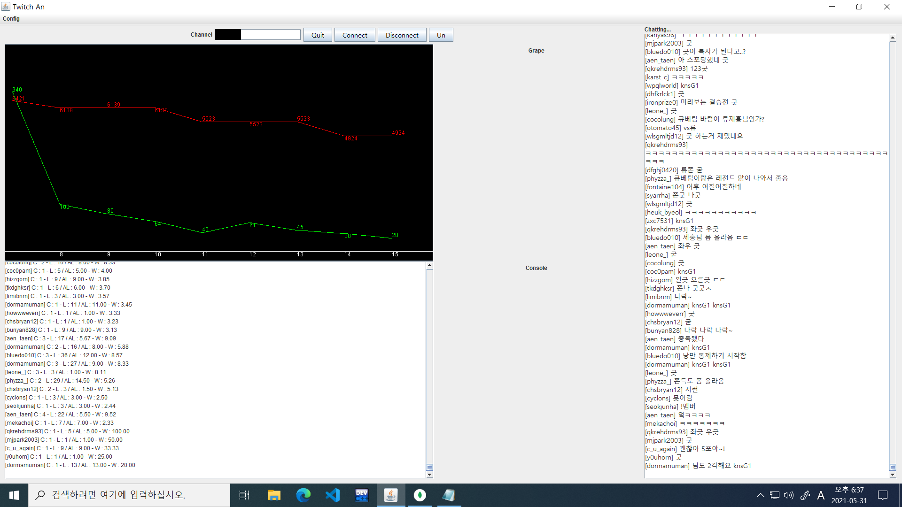
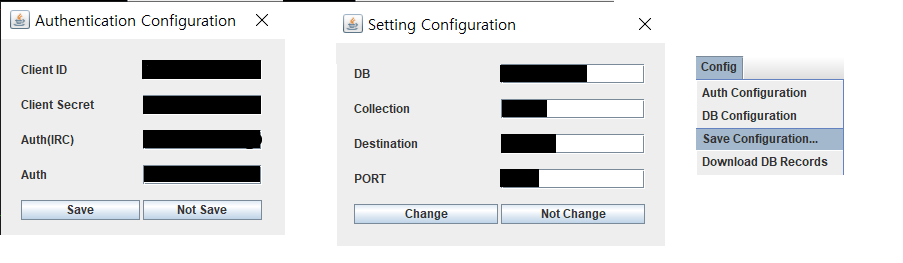
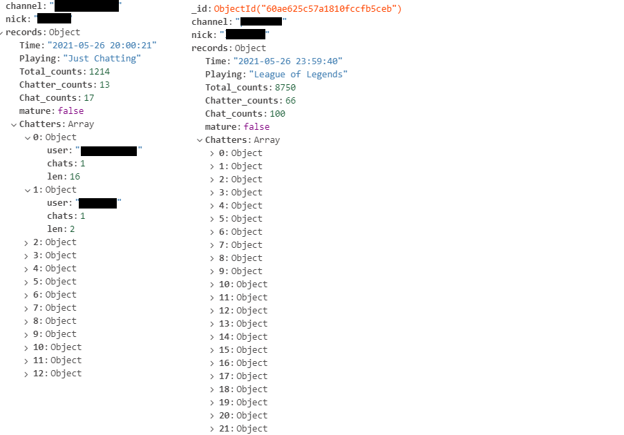
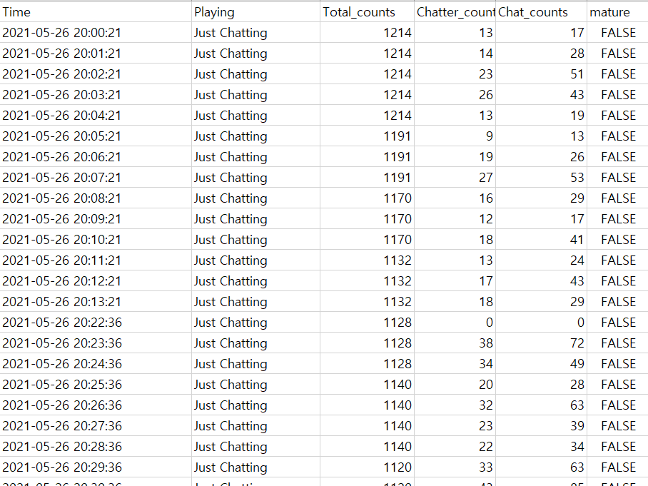

# Twitch-Chat-Record-in-Java
Summary
---

This Application is for recording who chat in Channel.

Display current amount of Chatters and whole Watchers.

+ DataBase - MongoDB
    + Why I choose MongoDB?
        + In Structure, 'Chatter Area' is not Undefined. This Area will change everytime.        

+ Language - Java

Work
---

+ Work

   
+ Configuration

+ DataBase

+ Xlsx

Detail
---

+ Write detail information like this.
    + C(count) - amount of chat that Chatter write per minute.
    + L(length) - length of chat for 1 minute that chatter write.
    + AL(average length) - average chat length that chatter write.
    + W(weigth) - chatter's share in total Chats

+ DataBase(MongoDB)    
    + Structure
        + channel
        + nick - channel owner's name)
        + records
            + Time
            + Playing - JustChatting, LoL etc...
            + Total_counts
            + Chatter_counts
            + Chat_counts
            + mature
            + Chatters
                + user
                + chats
                + len
               ...

Enviroment
---

Configuration
+ Twitch API AUTH(Key)
    + auth
    + client_auth
    + client_secret_auth
+ IRC
    + auth_irc
+ DataBase
    + database_name
    + collection_name
    + destination
    + port

Dependency
---
+ pirbot - client of IRC Server

+ json-simple - For parsing Json file(Twitch Rest Api response is Json)

+ POI - make Xlsx using DataBase Data
